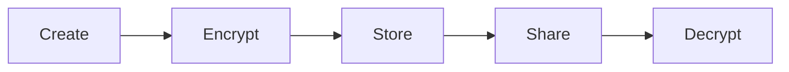
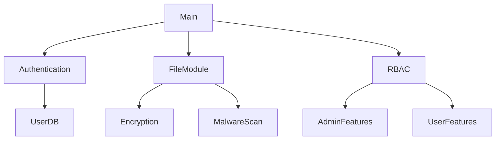

# 🔒 Secure File Management System (Java CLI)

[](LICENSE)
[](https://www.oracle.com/java/)


## 📖 Table of Contents
- [Project Description](#-project-description)
- [Key Features](#-key-features)
- [System Architecture](#-system-architecture)
- [Installation](#-installation)
- [Usage](#-usage)
- [Modules](#-modules)
- [Code Structure](#-code-structure)
- [Contributing](#-contributing)
- [License](#-license)

## 📖 Project Description
A command-line file management system with robust security features:
- Role-based access control (Admin/User)
- File encryption using Caesar Cipher
- Malware detection and prevention
- Secure file sharing between users
- Comprehensive user and file management

## 🌟 Key Features

### 🔐 Security Features
| Feature | Implementation |
|---------|---------------|
| Authentication | Password + OTP verification |
| Authorization | RBAC with admin/user roles |
| File Encryption | Custom Caesar Cipher (1-25 shift) |
| Malware Scan | 10+ signature patterns |
| Input Validation | File size/extensions/content checks |

### 📂 File Operations

🏗️ System Architecture
Core Components:


💻 Installation
Requirements
Java 17+ JDK

Terminal/Command Prompt

Setup
```bash

# Clone repository
git clone https://github.com/DrishtiJain-TheDeveloper/Secure-File-Management-System.git
cd Secure-File-Management-System

# Compile all Java files
javac -d bin src/*.java src/modules/*.java

# Run the application
java -cp bin Main
```
🖥️ Usage
Default Credentials
Role	Username	Password
Admin	admin	admin123
User	user1	user123
Command Line Interface
```bash

1. Authentication & Access Control
2. File Operations & Encryption  
3. Role-Based Access Control
4. Exit
```
Sample Workflow
Login with username/password + OTP

Select file operation:

Create encrypted file

Read/decrypt existing file

Share with other users

Admin users can:

List all users

Manage all files

📦 Modules
AuthenticationAccessControlModule
Handles user registration/login

Manages active sessions

OTP generation/verification

User listing (admin only)

FileModule
```java

public class FileModule {
    // File operations with security checks
    public void createFile(Scanner, username) {...}
    public void encrypt(content, shift) {...}
    private boolean isMalware(content) {...}
}
```
RoleBasedAccessControlModule
Different menus for admin/user

Permission enforcement

File ownership tracking

📂 Code Structure
```bash

src/
├── Main.java                 # Entry point
├── modules/
│   ├── AuthenticationAccessControlModule.java
│   ├── FileModule.java
│   └── RoleBasedAccessControlModule.java
bin/                          # Compiled classes
```
🤝 Contributing
Development Process
Fork the repository

Create feature branch:

```bash

git checkout -b feature/improved-encryption
```
Commit changes:

```bash

git commit -m "Add AES encryption support"
```
Push and open PR

Coding Standards
Follow Java naming conventions

Document public methods

Include input validation

Maintain 4-space indentation

📄 License
MIT License - See LICENSE for details.
